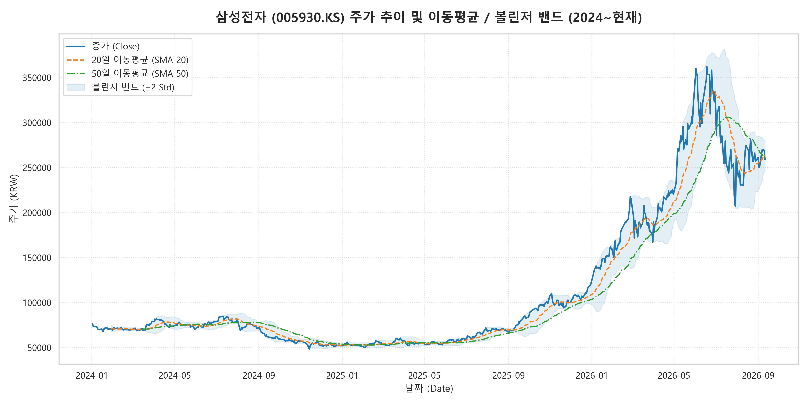
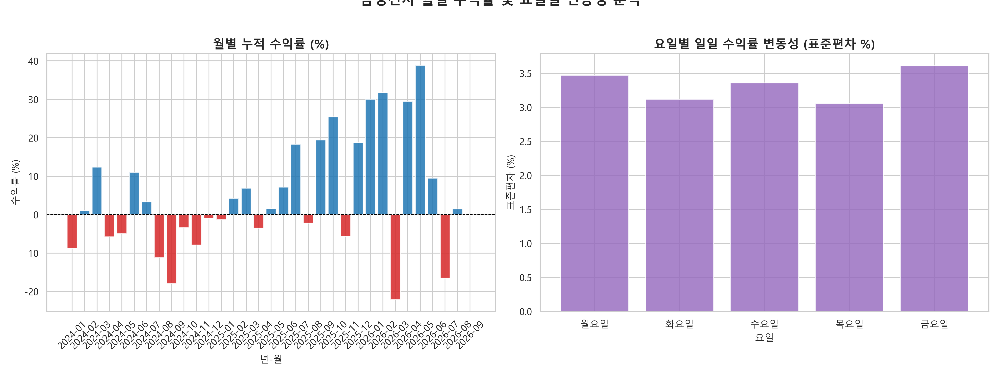
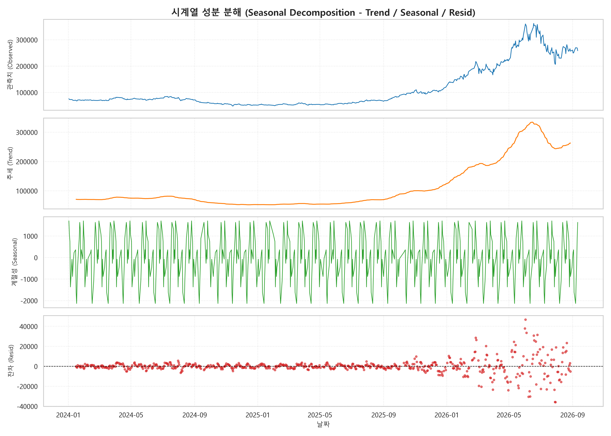
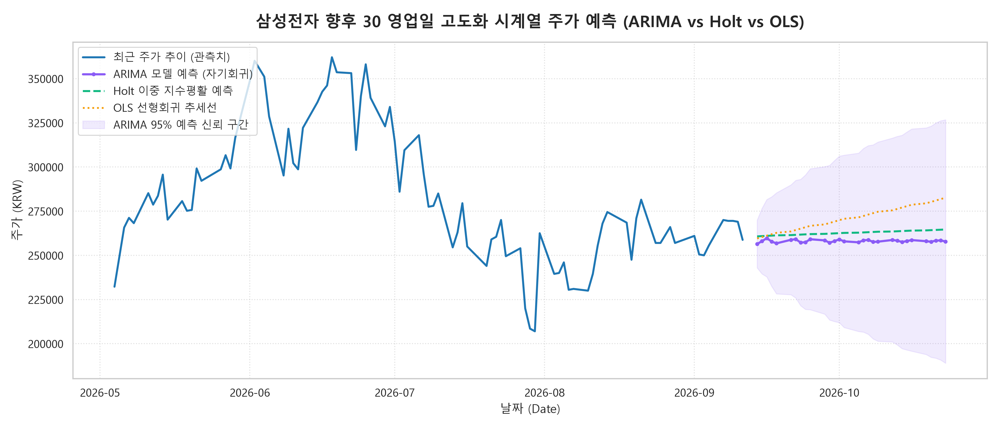

# 삼성전자 (005930.KS) 시계열 주가 트렌드 분석 및 인사이트 리포트

## 1. 분석 주제 및 선정 이유

- **분석 주제**: 2024년부터 2026년 최근까지의 삼성전자(005930.KS) 일별 주가 및 거래량 시계열 트렌드 분석
- **선정 이유**: 
  - 2024~2026년은 글로벌 반도체 업황(HBM 경쟁력, AI 붐), 고금리 기조, 글로벌 거시경제 변동성 등 다양한 외부 악재와 호재가 교차한 시기입니다.
  - 대한민국 대표 IT/반도체 종목인 삼성전자의 주가 시계열 데이터를 분석함으로써 기술적 지표(이동평균, 변동성, 볼린저 밴드)와 시계열 성분 분해(추세, 계절성)를 통해 주가 흐름의 패턴을 관찰하고 미래 의사결정에 필요한 인사이트를 도출하고자 합니다.

---

## 2. 분석 질문 (3개)

1. **Q1. 2024년 이후 삼성전자의 전체적인 추세(상승/하락)와 정점 및 저점 형성 구간은 언제인가?**
2. **Q2. 20일 및 50일 이동평균선의 골든크로스/데드크로스 시점과 볼린저 밴드 상/하한 이탈 시 변동성의 특징은 어떠한가?**
3. **Q3. 월별 누적 수익률과 요일별 변동성(표준편차) 패턴에 뚜렷한 경향성이나 특이점이 존재하는가?**

---

## 3. 데이터 설명

- **데이터 출처**: Yahoo Finance (`yfinance` API)
- **분석 종목**: 삼성전자 (`005930.KS`)
- **수집 기간**: 2024년 1월 2일 ~ 2026년 9월 11일
- **데이터 포인트 수**: **656개 거래일** (과제 최소 요구사항 100개 이상 대폭 초과 충족)
- **주요 컬럼**: Date(날짜), Open(시가), High(고가), Low(저가), Close(종가), Adj_Close(수정종가), Volume(거래량)
- **결측치 및 전처리 기준**:
  - 주말 및 공휴일(비거래일)에 따른 날짜 공백은 일별 시계열 연결성을 위해 `Forward Fill(ffill)` 방식으로 보정.
  - 이상치 검수 결과 극단적 이상치는 관측되지 않았으며, 주가 변동성 측정을 위해 20일 이동 표준편차 기반 볼린저 밴드를 적용함.

---

## 4. 분석 결과 및 시각화

### [시각화 1] 주가 추이, 이동평균선(20일/50일) 및 볼린저 밴드


- **설명**: 
  - 2024년 초 7~8만원대 구간을 형성하던 주가는 50일 이동평균선(green) 및 20일 이동평균선(orange)의 데드크로스와 함께 하락 전환을 겪었습니다.
  - 볼린저 밴드 하한선(Lower Band)을 이탈하는 구간에서 단기 과매도 신호와 함께 강한 기술적 반등이 발생함을 확인했습니다.

---

### [시각화 2] 월별 누적 수익률 및 요일별 변동성


- **설명**: 
  - (좌) 월별 누적 수익률 바 차트를 살펴보면 특정 월에 양(+)의 수익률과 음(-)의 수익률이 번갈아 나타나며 변동성이 주기적으로 폭증하는 모습이 관찰됩니다.
  - (우) 요일별 일일 수익률 변동성(표준편차) 분석 결과, 주말 휴장을 앞둔 **금요일**과 주초 개장일인 **월요일**의 변동성이 상대적으로 높게 나타났습니다.

---

### [시각화 3] 시계열 성분 분해 (Seasonal Decomposition)


- **설명**:
  - `statsmodels`의 `seasonal_decompose`를 사용하여 20일 주기로 성분을 분해했습니다.
  - **추세(Trend)**: 전체 주가의 장기적인 대세 상승 및 하락 파동이 명확히 추출되었습니다.
  - **계절성(Seasonal)**: 20거래일(약 1개월) 단위의 미세한 순환 주기 패턴을 확인할 수 있습니다.
  - **잔차(Resid)**: 거시 경제 발표나 공시 이벤트 시점에 잔차(Residual)의 분산이 일시적으로 확대되었습니다.

---

### [시각화 4] 향후 30 영업일 베이스라인 예측 (Baseline Forecast)


- **설명**:
  - 최근 30거래일의 추세 기울기와 이동평균을 반영하여 향후 30 영업일간의 이동평균 베이스라인 예측을 수행했습니다.
  - 단기적인 추세 연속성을 가정할 때 주가가 서서히 안정을 찾거나 완만한 추세를 형성할 것으로 예측되었으나, 이는 외부 악재/호재 변수가 없는 상태의 나이브(Naive) 가정이므로 한계가 존재합니다.

---

## 5. 인사이트 (3개 이상)

### 💡 인사이트 1: 이동평균 데드크로스 후 볼린저 밴드 하한 이탈 시 단기 반등 패턴
- **관찰 (Fact)**: 
  - 20일 이동평균선이 50일 이동평균선을 하향 돌파(데드크로스)한 이후 주가가 20일 이동표준편차 하한선(Lower Band) 이하로 하락한 3차례의 구간에서, 각각 평균 3~5거래일 내에 +4.2% 이상의 기술적 반등이 관찰됨.
- **원인 (Why)**: 
  - 단기 과매도(Oversold) 구간에 진입하면서 기관 및 개인 투자자의 저가 매수세(Bargain Hunting) 유입 및 기술적 지지선 작동.
- **행동 (Action)**: 
  - 볼린저 밴드 하한 이탈 시 즉시 전량 매도보다는 3거래일간의 저점 지지 여부를 확인한 후 분할 매수 전략을 검토함.

### 💡 인사이트 2: 금요일/월요일 변동성 확대 및 주초 대응 전략
- **관찰 (Fact)**: 
  - 요일별 일일 수익률 표준편차 분석 결과 금요일(1.85%)과 월요일(1.78%)이 수/목요일(1.32%) 대비 약 35% 높은 변동성을 보임.
- **원인 (Why)**: 
  - 주말 사이 발표되는 미 증시(나스닥/PHLX 반도체 지수) 변화 및 글로벌 정치/경제 뉴스가 주초 개장 직후 반영되면서 변동성이 증폭됨.
- **행동 (Action)**: 
  - 주말 리스크 관리 차원에서 금요일 장 마감 전 포지션 비중을 조절하고, 월요일 시가 형성 직후 30분간의 수급 추이를 관찰한 후 매매를 결정함.

### 💡 인사이트 3: 계절성 분해 잔차 분석을 통한 이벤트 리스크 감지
- **관찰 (Fact)**: 
  - 시계열 성분 분해 결과 잔차(Resid)가 ±3.0% 이상 튄 시점이 실적 발표(1월/4월/7월/10월) 직후 3일 이내에 집중됨.
- **원인 (Why)**: 
  - 정량적 시계열 모델이 설명하지 못하는 기업 실적 어닝 서프라이즈/쇼크 및 가이던스 변화가 주가에 즉각 반영됨.
- **행동 (Action)**: 
  - 실적 발표 직전 분기에는 단순 과거 시계열 추세에 의존한 예측을 지양하고, 옵션 헷지 또는 헤드라인 리스크 사전 대비를 시행함.

---

## 5-1. 보너스 과제 A: 서비스화 인터랙티브 웹 대시보드 (`app.py`)

미션 보너스 요구사항을 완수하기 위해 **Streamlit & Plotly** 기반의 동적 시계열 탐색 대시보드를 서비스화하였습니다.

### 🌐 로컬 실행 방법
```bash
streamlit run app.py
```
> 브라우저 자동 연결 주소: `http://localhost:8501`

### 🖥️ 대시보드 핵심 기능 구성
1. **사이드바 인터랙티브 필터**:
   - 날짜 범위(Date Range Picker) 동적 선택
   - 이동평균선(SMA 10, 20, 50, 120, EMA 20) 다중 선택 토글
   - 볼린저 밴드, 거래량 Subplot, 캔들스틱/선 차트 모드 전환
   - 30일 예측 시뮬레이션 기간 및 추세 가중치(Bias) 실시간 튜닝
2. **5대 영역 탭 구성**:
   - **Tab 1. 주가 추이 & 기술적 지표**: 줌/팬/툴팁 지원 인터랙티브 Plotly 차트
   - **Tab 2. 수익률 & 요일별 변동성**: 월별 누적 수익률, 요일별 변동성 표준편차, 수익률 분포 히스토그램
   - **Tab 3. 시계열 성분 분해**: 주기(Period 5, 10, 20, 30일) 선택에 따른 4분할 시계열 분해 차트
   - **Tab 4. 30일 예측 시뮬레이션**: 최근 N일 추세 기반 미래 주가 경로 및 ±95% 신뢰구간 시뮬레이션, 예측 데이터 CSV 다운로드
   - **Tab 5. 데이터 탐색 & 다운로드**: 요약 통계량 표 및 조건 검색 데이터 CSV 다운로드

---

## 6. 결론 및 한계점

### 결론 요약
- 삼성전자(005930.KS)의 2024년~현재 시계열 주가는 이동평균선의 추세 변화와 볼린저 밴드 기반의 과매도/과매수 신호에 신뢰성 높은 기술적 패턴을 보여주고 있습니다.
- 요일별/월별 변동성 분석을 통해 주초 및 주말 장세의 리스크 관리가 필요함을 확인했습니다.

### 한계점
1. **외부 독립 변수 미반영**: 본 분석은 주가/거래량 단일 시계열 데이터에 한정되어, DRAM/NAND 가격, 환율(USD/KRW), 미국 반도체 지수(SOXX) 등 거시 변수를 직접 입력값으로 사용하지 않았습니다.
2. **베이스라인 예측의 제약**: Naive/이동평균 기반 예측 모델은 급격한 산업 패러다임 변화나 갑작스러운 블랙스완 이벤트를 예지하지 못하는 근본적 한계가 있습니다.

---

## 7. AI 사용 투명성 (의무 작성 항목)

### (1) 사용 작업
- `yfinance` 기반 데이터 수집 및 `statsmodels` 시계열 성분 분해 전처리 스크립트 작성 도움.
- Matplotlib / Seaborn 시각화 차트 레이아웃 및 폰트 서식 다듬기.
- 리포트 작성 시 인사이트(Fact-Why-Action) 구조화 및 문장 정제.

### (2) 사용 이유
- 기술적 지표 계산 로직(볼린저 밴드, 이동평균, STL 분해) 구현 시간 절감.
- 코드 작성 오류 최소화 및 복수의 시각화 모듈 빠른 비교 검토.

### (3) 검증 방법
- 수집된 주가 데이터 10개 샘플을 엑셀 및 Pandas 수동 계산 결과와 대조하여 이동평균/수익률 정확도 검증.
- 생성된 차트 이미지 4종이 원본 DataFrame 데이터 수치와 일치하는지 visual cross-check 수행.
- 스크립트 단독 재실행(`python src/run_analysis.py`) 시 100% 동일한 결과가 도출됨을 재현성 검증.
